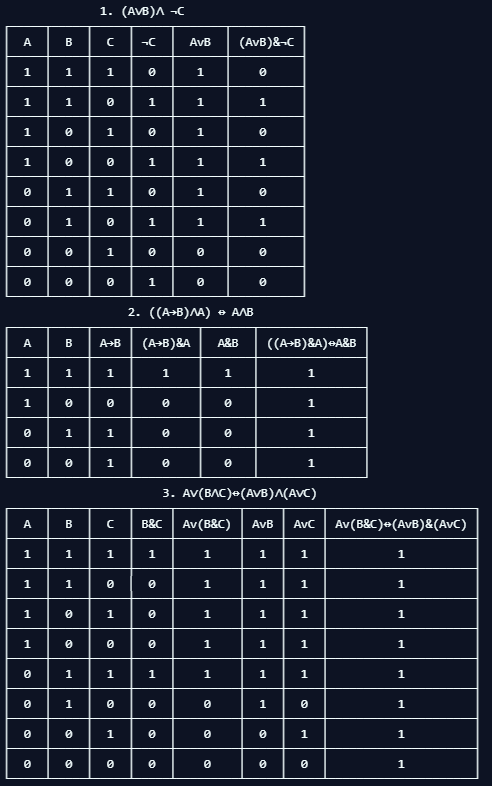

 ## Задание
>  [Текст задания](https://moodle.herzen.spb.ru/pluginfile.php/132109/mod_resource/content/4/Practice-2.html)

### Задание 1-2
> Логическая задача. Требуется для двух или трех входных переменных (A, B, C) построить таблицы истинности (см. свой вариант)
>
> Используя конкатенацию строк, функцию print(), а также умножение строки на число, создайте оформление для таблиц истинности, созданных в рамках предыдущего задания.

## Результат 

+ [Ссылка на Repl.it](https://repl.it/@ArthurMozart/Tabl)

### Задание 3
> Дан список: 0, 1, 1, 2, 3, 5, 8, 13, 21, 34, 55, 89, 144, 233, 377, 610, 987, 1597, 2584, 4181, 6765, 10946
>
> Для данного списка, используя слайсы, обращение к элементам по индексу (не используя циклы или условные операторы) найдите:
> + Сумму элементов, стоящих на четных местах списка с минимальным элементом этого списка.
> + [для кортежа, см. ниже] Список названий полей (name, n_of_wheels, ...)
> 
> Дан кортеж:
>
> car = ("name", " DeLorean DMC-12", "motor_pos": "rear", "n_of_wheels", 4, "n_of_passengers", 2, "weight", 1.230, "height", 1.140, "length", 4.216, "width", 1.857, "max_speed", 177)

## Результат

+ [Ссылка на Repl.it](https://repl.it/@ArthurMozart/Slas1)
