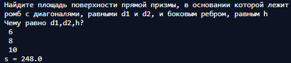

### [Ссылка на Repl.it](https://repl.it/@ArthurMozart/Func)

## Задание 7
> Объем куба равен v. Найдите площадь его поверхности.
Решение задачи оформите в виде функции square(v), которая будет возвращать
результат s. Например, при v=8 функция square(8) вернет s=24

## Результат
.png)

## Задание 8
> Найдите площадь поверхности прямой призмы, в основании которой лежит ромб
с диагоналями, равными d1 и d2, и боковым ребром, равным h.
Решение задачи оформите в виде функции square(d1,d2,h) которая возвращает
значение переменной s. Например, при d1=6; d2=8; h=10 функция square(6,8,10) вернет
s=248

## Результат

